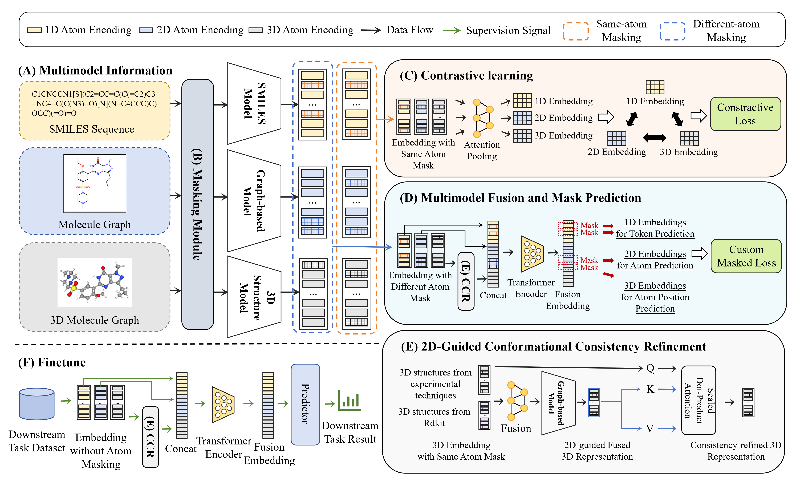

# Molrep-MVP

**A unified multi-modal pre-training framework for molecular representation learning**

Molrep-MVP is a multi-modal molecular representation learning framework designed to jointly model **2D molecular graphs**, **3D molecular conformations**, and **fragment-aware molecular priors**. The core idea is to learn robust molecular representations through **multiview contrastive learning** and **prior-knowledge-guided fragment tokenization**, with a focus on molecular property prediction.

According to the project description, Molrep-MVP captures both **cross-modal relationships between 2D and 3D views** and **intra-view relationships within each modality**. It also uses **dynamic conformation sampling** and **fragment decomposition/tokenization** to better model molecular diversity and improve downstream performance.

---

## Highlights

- **Multi-modal learning** over molecular 2D and 3D views
- **Multiview contrastive pre-training** for robust representation learning
- **Dynamic conformation sampling** to capture structural diversity
- **Fragment-aware prior knowledge integration** for fine-grained alignment
- **Designed for molecular property prediction** and transfer to downstream tasks

---

## Model Architecture


---

## Repository Structure

```text
.
├── ESPF/   # Fragment-related resources or tokenization modules used for prior-knowledge-enhanced molecular representation.
├── model/  # Model definitions and core network components.
├── process_dataset/ # Data preprocessing scripts for preparing molecular datasets and model inputs.
├── roberta-base/  # Local pretrained RoBERTa resources or configuration files used by the sequence branch.
├── environment.yml  # Conda environment specification for reproducing the project.
├── finetune.py  # Entry script for downstream fine-tuning and evaluation.
├── loss.py   # Loss function definitions used in pre-training and/or fine-tuning.
├── pcqm4m.py  # Dataset loading or task-specific utilities for PCQM4M-related experiments.
├── pretrain.py  # Entry script for multi-modal pre-training.
└── utils.py  # Common helper functions.
```
## Installation

### 1. Clone the repository

```bash
git clone https://github.com/mamengTang/Molrep-MVP.git
cd Molrep-MVP
```
### 2. Create the environment

```bash
conda env create -f environment.yml
conda activate molrep-mvp
```
## Data Preparation

If you use **PCQM4M**, dataset-related logic may be organized in `pcqm4m.py`.
The downstream task datasets can be obtained here.
https://github.com/Hhhzj-7/MolMVC.git

## Pre-training

Run the multi-modal pre-training stage with:

```bash
python pretrain.py
```
## Fine-tuning

After pre-training, fine-tune the model on downstream molecular property prediction tasks:

```bash
python finetune.py
```


